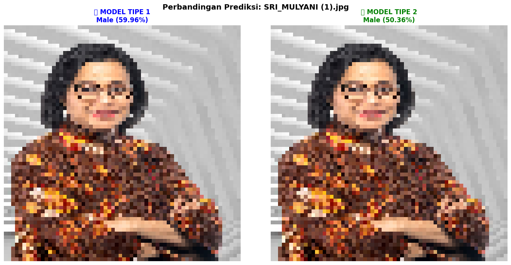
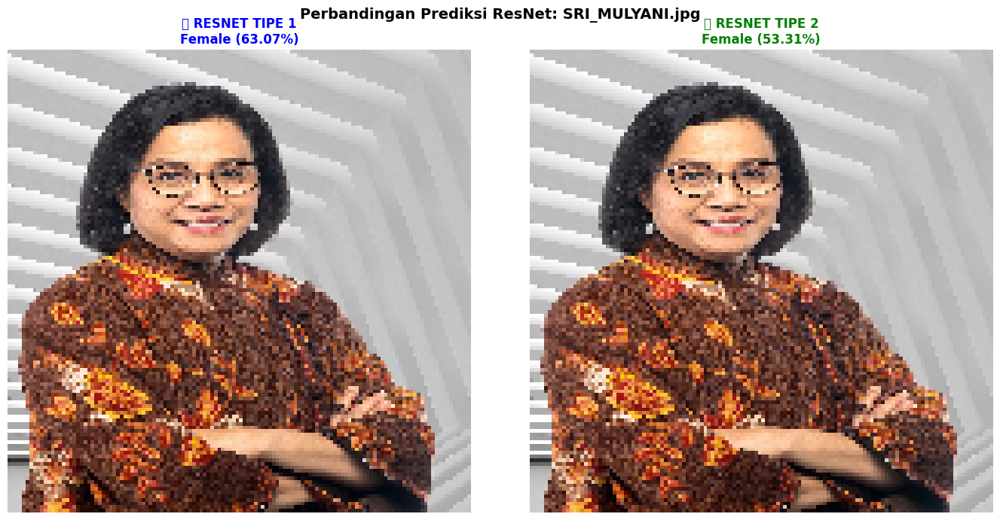
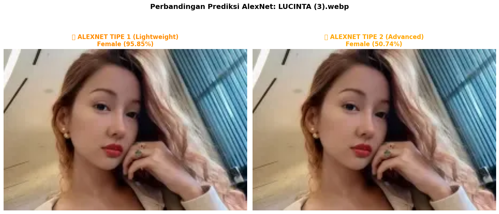
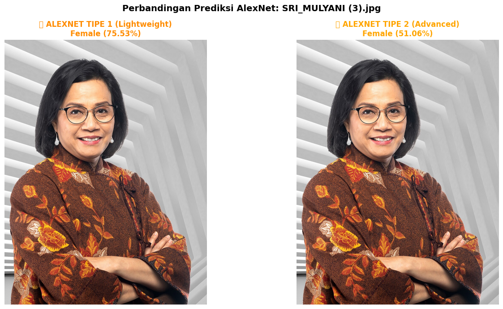

# Face Gender Classification using CNN Architectures

Repository ini berisi implementasi dan hasil eksperimen **Face Gender Classification** menggunakan berbagai arsitektur Convolutional Neural Networks (CNN) yang populer.

## 📊 Dataset
CelebA Dataset

## 🧠 Algoritma yang Digunakan

### 1. VGGNet
VGGNet dikembangkan oleh Visual Geometry Group dari Oxford University. Model ini terkenal karena menggunakan filter konvolusi kecil (3×3) secara konsisten di seluruh arsitektur, membuatnya sangat efektif untuk face recognition tasks.

**Hasil VGG:**



### 2. GoogleNet (Inception)
GoogleNet atau Inception Network diperkenalkan oleh Google pada 2014. Inovasi utamanya adalah penggunaan "Inception modules" yang memungkinkan network untuk memproses multi-scale features secara paralel (1×1, 3×3, 5×5 convolutions).

**Hasil GoogleNet:**


### 3. ResNet
Residual Network (ResNet) dikembangkan oleh Microsoft Research. Inovasi utamanya adalah "skip connections" yang memungkinkan training network sangat dalam tanpa vanishing gradient problem. Model ini menggunakan transfer learning dari ImageNet pretrained weights.

**Hasil ResNet:**



### 4. AlexNet
AlexNet adalah arsitektur CNN yang revolusioner, diperkenalkan pada 2012 oleh Alex Krizhevsky. Model ini menjadi pionir dalam penggunaan deep learning untuk image classification dengan large kernels (11×11, 5×5) untuk capturing global features.

**Hasil AlexNet:**



---

## 🏆 Top 5 Model Performance

| Rank | Model | Accuracy | Loss | Epochs | Batch | Learn Rate | Dropout | Train Time | Size |
|------|-------|----------|------|--------|-------|------------|---------|------------|------|
| 🥇 1 | **VGG V2** | **94.40%** | 0.245 | 20 | 64 | 0.0001 | 0.5 | 77.29 Detik | 17.66 MB |
| 🥈 2 | **GoogleNet V2** | **93.90%** | 0.2669 | 20 | 64 | 0.0001 | 0.5 | 437.23 Detik | 22.79 MB |
| 🥉 3 | **VGG V1** | **92.75%** | 0.2329 | 10 | 32 | 0.001 | 0.3 | 54.95 Detik | 17.66 MB |
| 4 | **AlexNet V1** | **85.00%** | 0.6888 | 10 | 32 | 0.001 | 0.3 | 23.60 Detik | 17.31 MB |
| 5 | **GoogleNet V1** | **58.45%** | 0.6794 | 10 | 32 | 0.001 | 0.3 | 107.45 Detik | 22.79 MB |

---

## 📊 Complete Model Results

| Model | Accuracy | Loss | Epochs | Batch | Learn Rate | Dropout | Train Time | Parameters |
|-------|----------|------|--------|-------|------------|---------|------------|------------|
| VGG V1 | 92.75% | 0.2329 | 10 | 32 | 0.001 | 0.3 | 54.95 Detik | 17.66 MB |
| VGG V2 | 94.40% | 0.245 | 20 | 64 | 0.0001 | 0.5 | 77.29 Detik | 17.66 MB |
| GoogleNet V1 | 58.45% | 0.6794 | 10 | 32 | 0.001 | 0.3 | 107.45 Detik | 22.79 MB |
| GoogleNet V2 | 93.90% | 0.2669 | 20 | 64 | 0.0001 | 0.5 | 437.23 Detik | 22.79 MB |
| ResNet V1 | 58.25% | 0.6824 | 10 | 32 | 0.001 | 0.3 | 41.72 Detik | 97.8 MB |
| ResNet V2 | 58.25% | 0.6822 | 20 | 64 | 0.0001 | 0.5 | 61.63 Detik | 92.14 MB |
| AlexNet V1 | 85.00% | 0.6888 | 10 | 32 | 0.001 | 0.3 | 23.60 Detik | 17.31 MB |
| AlexNet V2 | 58.25% | 0.6902 | 20 | 64 | 0.0001 | 0.5 | 15.14 Detik | 24.33 MB |

---

## 📈 Key Insights

### 🏆 **Champion: VGG V2 (94.40%)**
- ✅ **Highest accuracy** among all models
- ✅ **Fast training** (77.29 detik)
- ✅ **Smallest model size** (17.66 MB)
- ✅ **Production-ready** for deployment

### 💡 **Best Value: VGG V1 (92.75%)**
- ✅ **92.75% accuracy in under 1 minute!**
- ✅ **Perfect for quick experimentation**
- ✅ **Lightweight configuration**

### ⚠️ **Failed Models (All ~58% accuracy):**
- ❌ **ResNet V1/V2** (58.25%): Transfer learning domain mismatch (ImageNet → Faces)
- ❌ **AlexNet V2** (58.25%): Large kernels (11×11) incompatible with small input (64×64)
- ❌ **GoogleNet V1** (58.45%): Severe underfitting (10 epochs insufficient for Inception modules)

### 🔬 **Key Findings:**
1. **Simple beats Complex**: VGG's straightforward 3×3 kernel stacking outperformed complex architectures
2. **Epochs Matter**: GoogleNet improved from 58.45% (V1) to 93.90% (V2) by doubling epochs (10→20)
3. **Transfer Learning Can Fail**: ResNet pretrained on ImageNet failed to adapt to face classification
4. **Architecture-Input Match**: AlexNet's large kernels designed for 227×227 failed on 64×64 input

---

## 📁 Struktur Repository

```
federico-cv2/
├── README.md
├── VGG_GOOGLENET_RESNET_ALEXNET.ipynb
└── images/
    ├── VGG_LUCINTA_LUNA.png
    ├── VGG_SRI_MULYANI.png
    ├── GOOGLE_NET_LUCINTA_LUNA.png
    ├── GOOGLE_NET_SRI_MULYANI.png
    ├── RESNET_LUCINTA_LUNA.png
    ├── RESNET_SRI_MULYANI.png
    ├── ALEX_NET_LUCINTA_LUNA.png
    └── ALEX_NET_SRI_MULYANI.png
```

---

## 🚀 How to Use

1. **Clone repository:**
   ```bash
   git clone https://github.com/RepoGarage/federico-cv2.git
   cd federico-cv2
   ```

2. **Open Jupyter Notebook:**
   ```bash
   jupyter notebook VGG_GOOGLENET_RESNET_ALEXNET.ipynb
   ```

3. **Run all cells** to reproduce the experiments

---

## 📊 Hyperparameter Configurations

### V1 (Lightweight)
- Epochs: 10
- Batch Size: 32
- Learning Rate: 0.001
- Dropout: 0.3

### V2 (Advanced)
- Epochs: 20
- Batch Size: 64
- Learning Rate: 0.0001
- Dropout: 0.5

---

## 🎯 Conclusion

**VGG V2 emerges as the clear winner** with 94.40% accuracy, proving that simple, well-designed architectures can outperform complex ones when properly tuned. The experiment demonstrates that:

- ✅ **Domain-specific training** beats transfer learning for mismatched tasks
- ✅ **Architecture simplicity** often trumps complexity
- ✅ **Proper hyperparameter tuning** is critical for convergence