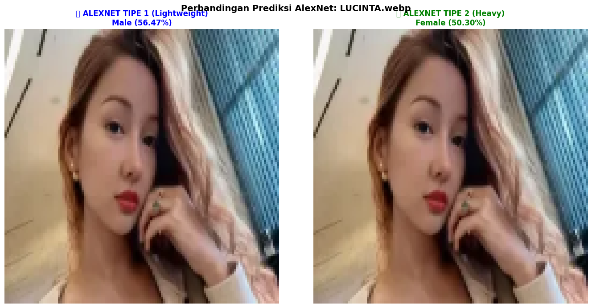

# Computer Vision Algorithm Results

Repository ini berisi implementasi dan hasil dari berbagai algoritma Computer Vision menggunakan Convolutional Neural Networks (CNN) yang populer.

## Algoritma yang Digunakan

### 1. AlexNet
AlexNet adalah arsitektur CNN yang revolusioner, diperkenalkan pada 2012 oleh Alex Krizhevsky. Model ini menjadi pionir dalam penggunaan deep learning untuk image classification dan memenangkan kompetisi ImageNet 2012. AlexNet memiliki 8 layer (5 convolutional + 3 fully connected) dan menggunakan ReLU activation function.

**Hasil AlexNet:**


### 2. VGGNet
VGGNet dikembangkan oleh Visual Geometry Group dari Oxford University. Model ini terkenal karena menggunakan filter konvolusi kecil (3x3) secara konsisten di seluruh arsitektur. VGG memiliki variasi seperti VGG-16 dan VGG-19, yang menunjukkan jumlah layer dalam network.

**Hasil VGGNet:**


### 3. GoogleNet (Inception)
GoogleNet atau Inception Network diperkenalkan oleh Google pada 2014. Inovasi utamanya adalah penggunaan "Inception modules" yang memungkinkan network untuk memilih secara otomatis ukuran filter yang optimal. Model ini lebih efisien dalam penggunaan parameter dibandingkan arsitektur sebelumnya.

**Hasil GoogleNet:**


### 4. ResNet
Residual Network (ResNet) dikembangkan oleh Microsoft Research dan memenangkan ImageNet 2015. Inovasi utamanya adalah "skip connections" atau "residual connections" yang memungkinkan training network yang sangat dalam (hingga 152 layer) tanpa mengalami vanishing gradient problem.

**Hasil ResNet:**


## Ranking Performa Berdasarkan Analisis

- **VGG Tipe 1 (93.75%)** – Validasi paling tinggi, cepat konvergen, stabil
- **GoogleNet Tipe 2 (93.10%)** – Akurasi tinggi, setara VGG, tapi butuh tuning careful
- **VGG Tipe 2 (92.95%)** – Akurasi tinggi, tapi overfitting lebih besar dari Tipe 1
- **ResNet Tipe 2 (84.75%)** – Terbaik untuk dataset kecil (1.6K), fine-tuning sukses
- **AlexNet Tipe 1 (67.75%)** – Moderate, berat untuk dataset kecil, perlu improvement
- **AlexNet Tipe 2 (60.25%)** – Gagal, overfitting parah, hyperparameter salah
- **GoogleNet Tipe 1 (58.75%)** – Gagal total, underfitting, LR salah
- **ResNet Tipe 1 (58.25%)** – Gagal total, transfer learning tanpa fine-tuning tidak cukup

## Struktur Repository

```
federico-cv2/
├── README.md
├── AlexNet.png
├── VGG.png
├── GoogleNet.png
├── ResNet.png
└── VGG_GOOGLENET_RESNET_ALEXNET.ipynb
```
